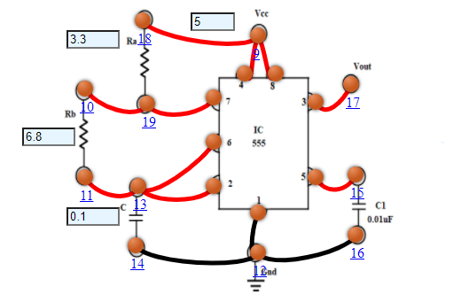

## Procedure

1. Connect the components as mentioned below:
L1-L12, L14-L12, L16-L12, L4-L9, L8-L9, L10-L19, L3-L17, L11-L13, L7-L19, L6-L13, L2-L13, L5-L15, L18-L9.(For eg. click on 1 and then drag to 12 and so on.)
2. Click on 'Check Connection' button to check the connections.
3. If connected wrong, click on the wrong connection. Else click on 'Delete all connection' button to erase all the connections.
4. Intially set R a=3.3 kΩ, R b=6.8kΩ, C=0.1µf, Vcc=5 V.
5. Click on "Calculate" button.
6. Now note the output voltage.
7. Click on "Plot" button to plot Output Voltage, Capacitance Voltage
8. Click on "Clear" button to clear the data.
9. Repeat the experiment for another set of resistance value.
10. Set the Resistance (Ra) value (1 kΩ - 10 kΩ).
11. Set the Resistance (Rb) value (1 kΩ - 10 kΩ).
12. Set the Capacitance (C) value (0.1 µf - 10 µf) .
13. Set supply voltage (Vcc).

Figure 1

