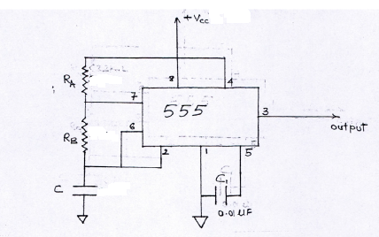
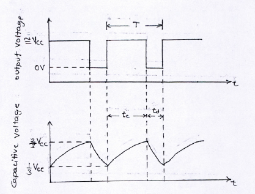

## Theory 

One of the most versatile linear ICs is the 555 times. It was first introduced in early 1970 by Signetic Corporation giving the name as SE/NE 555 timer. The 555 is a monolithic timing circuit that can produce highly stable time delays or oscillation. The timer basically operates in one of the two modes either as monostable or as an astable multivibrator.

A astable multivibrator, often called a free-running multivibrator, is a rectangular-wavegenerating circuit. Unlike the monostable multivibrator this circuit does not require any external triggering to change the state of the output, hence the name free-running. However, the time during which the output is either high or low is determined by the two resistors and a capacitor, which are externally connected to the 555 timer.

#### 555 pin configuration

The 555 IC is available as an 8-pin metal can as given below.

Figure 1

**Pin1 : Grounded Terminal** All the voltages are measured w.r.t. this terminal.  
**Pin2 : Trigger Terminal** This pin is an inverting input to a comparator that is reponsible for transition of flip-flop from set to reset. The output of the timer depends on the amplitude of the external tigger pulse applied to this pin.  
**Pin3 : Output Terminal** Output of the timer is available at this pin. There are two ways in which a load can be connected to the output terminal either between pin 3 and ground pin or between pin 3 and supply pin.  
**Pin4 : Reset Terminal** To disable or reset the timer a negative pulse is applied to this pin due to which it is referred to as reset terminal. When this pin is not to be used, it should be connected to +Vcc to avaoid any possibility pf false triggering.  
**Pin5 : Control Voltage Terminal** The function of this terminal is to control the threshold and trigger levels. Thus either the external voltage or apot connected to this pin determines the pulse width of the output waveform. The external voltage applied to this pin can also be used to modulate th eoutput waveform. When this pin is not used, it should be connected to ground through a 0.01uF to avoid any noice problem.  
**Pin6 : Threshold Terminal** This is the noninverting input terminal of comparator 1,which compares the voltage applied to this terminal with a refernce volatge of +2/3 Vcc. The amplitude of the volatge applied to this terminal is responsible for the set state of flip flop.  
**Pin7 : Discharge Terminal** This pin is connected internally to the collector of transistor and mostly a capacitor is discharge terminal because when transistor saturates, capacitor discharges through the transistor. When the transistor is cutoff, the capacitor charges at a rate determined by external resistor and capacitor.  
**Pin8 : Supply Terminal** A supply voltage of +5V to +18V is applied to this terminal w.r.t. to ground pin.  

#### The 555 Timer as an Astable Multivibrator

The schematic of a 555 timer in Aonostable mode of operation is shown in figure 2. The ciruit details are given below. Pin 1 is grounded; pins 4 and 8 are shorted and then tied to supply +Vcc. Output is taken from pin 3; pin2 and pin 6 are shorted and then connected to ground through a capacitor. Pin 7 is connected to ground through a resistor RA; and between pins 6 and 7 a resistor RB is connected. At pin 5 either a bypass capacitor of 0.01uF is connected or modulation input is applied.

Figure 2

#### Astable operation:
According to figure 3 initially when output is high, capacitor C starts charging toward Vcc through RA and RB. However as soon as voltage across the capacitor equals 2/3 Vcc, comparator 1 triggers the flip-flop, and the output switches low. Now capacitor C stars discharging through RB and transistor Q1. When the voltage across C equals 1/3 Vcc, comparator 2’s output triggers the flip-flop, and the output goes high. Then the cycle repeats. The output voltage and capacitor voltage are shown in fig (b). As shown in this figure, the capacitor is periodically charged and discharged between 2/3 Vcc and 1/3 Vcc, respectively. The time during which the capacitor charge from 1/3 Vcc
to 2/3 Vcc is equal to the time the output is high and is given by

$$ t_c = 0.69(R_A + R_B) \times C $$

Where RA and RB are in ohms and C is in farads. Similarly, the time during which the capacitor
discharges from 2/3Vcc to 1/3Vcc is equal to the time the output is low and is given by
$$ t_d = 0.69(R_B) \times C $$
Thus the total period of output waveform is
$$ T = t_c + t_d = 0.69(R_A + 2R_B) \times C $$

Frequency of Oscillation is
$$ f_o = \frac{1}{T} = \frac{1.45}{(R_A + 2R_B)\times C} $$

Duty Cycle:- The duty cycle is the ratio of the time tc during which the output is high to the total time
period T. It is generally expressed as a percentage
% $$ duty cycle = \frac{t_c}{T} \times 100 $$
= $$ \frac{(R_A + R_B)}{(R_A + 2R_B)} \times 100 $$

Figure 3

#### Applications of Astable multivibrator

1. The Astable multivibrator is used as sqaure wave oscillator.
2. It is also used as free runnning ramp generator.
3. It is used as pulse position modulator.
4. It is also used for Schmitt trigger using 555 timer

